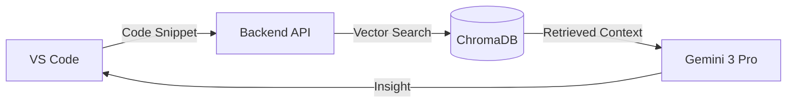

# 🧠 ContextSync: Institutional Memory as a Service


> **Stop Coding in the Dark.** ContextSync bridges the gap between your IDE and your team's conversations, preventing "invisible bugs" by surfacing critical historical context.

---

## 🚨 The Problem
You are reviewing code that looks perfect. It has retry logic. It catches exceptions. It passes the linter.
**But it's wrong.**
Because six months ago, a Staff Engineer mentioned in a Slack thread that "Gateway V2 requires an Idempotency Key".
You didn't see that message. **ContextSync did.**

## ✨ Features
*   **🕵️ Explain Intent**: Highlights code and explains *why* it exists based on historical context, not just syntax.
*   **📇 Context Cards**: Surfaces raw Slack threads and Jira tickets directly in your sidebar.
*   **🧠 RAG Engine**: Uses a Vector Database (ChromaDB) to perform semantic search across your entire engineering history.
*   **⚡ Instant Insight**: Turns a 30-minute investigation into a 3-second sidebar lookup.

## 🏗️ Architecture


## Flowchart:


<a src=https://excalidraw.com/#json=tDGUWnc8xLdYVLTPOpl-8,nbXH2PbfV91m5paLQ4lBiQ>Excalidraw</a>

## Preview

https://github.com/user-attachments/assets/1a8b9b99-b190-49e3-8f47-3fefc5b9abe7


## 📦 Installation & Setup

### 1. Backend Service
The brain of the operation. Runs locally on port `8000`.

```bash
cd backend
python -m venv venv
source venv/bin/activate  # Windows: venv\Scripts\activate
pip install -r requirements.txt

# Create .env file with GOOGLE_API_KEY=your_key
uvicorn app.main:app --reload
```

### 2. VS Code Extension
The frontend interface.

```bash
cd vscode-extension
npm install
npm run compile
# Press F5 to launch the Extension Host
```

## 🎥 Scenario Demo
Included in this repo is a `demo/` folder containing a dangerous payment processor script (`payment_processor.py`). Use this to demonstrate how ContextSync detects the missing "Idempotency Key" by cross-referencing mock Slack data.

## 🤝 Contributing
Contributions are welcome! Please fork the repository and open a pull request.

1.  Fork the Project
2.  Create your Feature Branch (`git checkout -b feature/AmazingFeature`)
3.  Commit your Changes (`git commit -m 'Add some AmazingFeature'`)
4.  Push to the Branch (`git push origin feature/AmazingFeature`)
5.  Open a Pull Request

---
